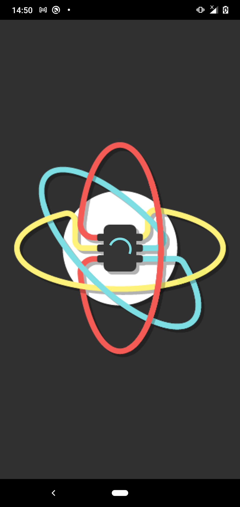
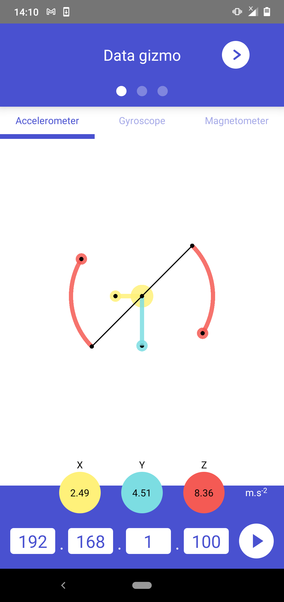
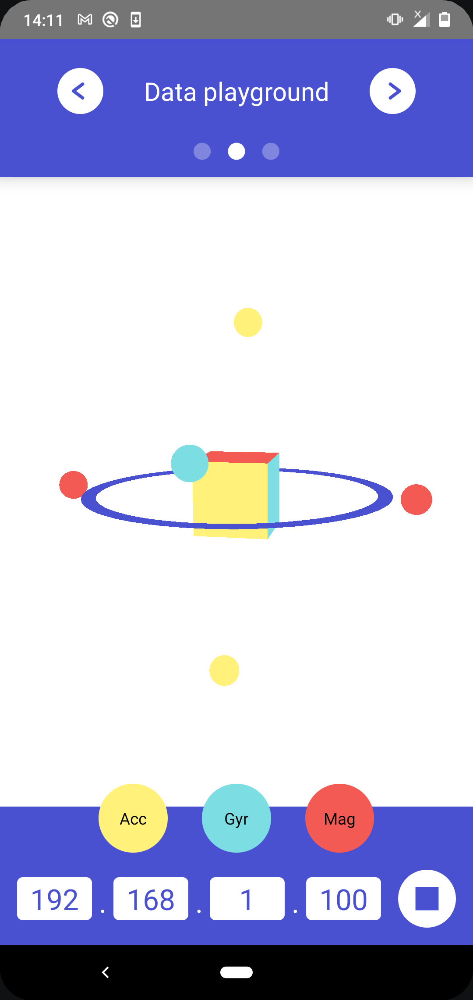
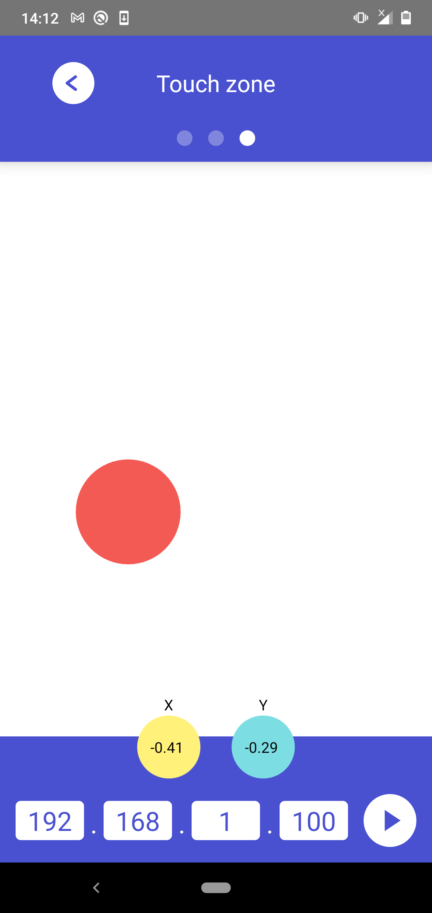

# Streamo

#### A mobile app emulating a Movuino WiFi device (with visualization)

more info on [www.movuino.com](http://www.movuino.com/)

  
   
  
  

<!--
 | 

-->

### OSC

Streamo sends all its OSC frames on the port `7400`.

A valid target IP address must be entered in the bottom page fields to enable OSC data sending.
Once this is done the play button becomes clickable, and allows to toggle the OSC data sending on and off.
The target IP address is automatically saved across sessions.

When the play button is toggled on :

* Streamo continuously sends a single OSC frame of the form :  
`/streamo streamo <accx> <accy> <accz> <gyrx> <gyry> <gyrz> <magx> <magy> <magz>`
* From the third page, `touchstart` and `touchmove` events are forwarded as OSC frames of the form :  
`/touch <x> <y>`

the `<accx> ... <magz>` values in the continuously streamed `/streamo ...` frame
correspond to the phone's accelerometer, gyroscope and magnetometer 3D sensors, respectively.
They are sent in the units displayed in the first page (m.s-2, rad.s-1, µT), except
the magnetometer which values are normalized across its 3 dimensions, for compatibility reasons.

### Dev notes

#### Project status

At the moment only the Android version is working as expected.

iOS issues :

* some sensor units need to be converted and some axis exchanged
* the `react-native-osc` library is not outputting data as expected (needs to be fixed).

#### Environment setup

This version of Streamo is based on React Native.
It is a bare React Native project, but relies on Expo libraries (`expo-gl` and `expo-three`) to allow using the `threejs` library in an OpenGL context.
Make sure to follow the React Native [environment setup guide](https://reactnative.dev/docs/environment-setup) if you want to build it yourself.  
Also make sure to have the [side by side NDK installed](https://stackoverflow.com/a/61212237/3810717) for Android builds, you will need it to build OpenGL.
As is the case with bare projects, it also relies on the `react-native-unimodules` library to allow using Expo libraries.
When doing so, make sure to follow the [installation instructions](https://docs.expo.io/bare/installing-unimodules/) and not forget to remove the unimodule dependencies that are not required (already done in this project).

TL;DR :

- For Android, in `android/app/build.gradle` : addUnimodulesDependencies([exclude: ['dependency_to_exclude', ...]])
- For iOS, in `ios/Podfile` : use_unimodules!(exclude: ['dependency_to_exclude', ...])

Useful resources :

* https://medium.com/@akinncar/how-to-develop-3d-games-with-react-native-using-three-js-d01b8132758
* https://blog.expo.io/you-can-now-use-expo-apis-in-any-react-native-app-7c3a93041331
* https://docs.expo.io/bare/installing-unimodules/

This one was useful when changing package / display names in the project :
(and also don't leave an old .babelrc file at the root of the project mess up your js builds)

* https://dev.to/karanpratapsingh/quick-guide-for-updating-package-name-in-react-native-3ei3

#### SplashScreen

The splash screen library used in this project is `react-native-splash-screen`
Make sure to follow the instructions in the library's github README to make it work (already done in this project)
To fix the white screen before splash screen issue, see [this issue](https://github.com/crazycodeboy/react-native-splash-screen/issues/338#issue-389809278), and in particular [this comment](https://github.com/crazycodeboy/react-native-splash-screen/issues/338#issuecomment-447251703) for Android
